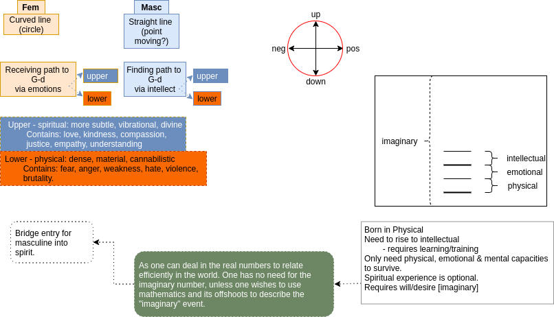

## Masculine & Feminine

Instead of looking at ourselves as some sort of "[object](objectification.html),
`{the "objectification" of living beings. and in fact, "non-living" objects as well - this producing the concept of "[private](privacy_illusion.html) property"}`
as an ["ideal" to attain, an imagined perfection](superior_man.html), as illustrated by Jesus, Buddha, Mother Teresa, and [other significant and influential figures](golden_shadow.html). What if we viewed ourselves and our fellow beings as works-in-progress? Imagine everyone walked around with an "under construction" sign. Because who dies completely fulfilled? There is always something or, if you are lucky, someone left behind.

Why not look at ourselves, our world, in fact the whole darn universe, as dynamic systems. Systems that are always in some sort of flux, some of which is obvious and some of which is not. There is so much that happens, and that could happen, that we are unaware of, and that affect us. We are like fish in the ocean. All we can do, as regards the ocean itself, is just live in it and with it. We can search for food, and harvest what we can from our surroundings - but the currents that bring the nourishment, and the sun that nurtures them, and the many complex events that have to occur in order for this food to arrive and this current to flow is beyond anything we can imagine, and this flux affects us, even if we are seemingly still "who we were".

Even in our lives we think we are a constant, and not in constant flux. Besides the fact that our body is, our emotions are, and our mind is constanly breathing, feeling and thinking. How balanced they are depends on a number of factors, but training and practice is at their core. But as we grow, we move from one "type" of person to another. I am not the toddler I was when I was born. I have grown from being the young boy I was cavorting around the garden. I am not longer the father I was to my young children. Although I might still be, and always will be, their father, I am not longer the father I was then, for they are grown with their own children. And so it goes on - till I die.
