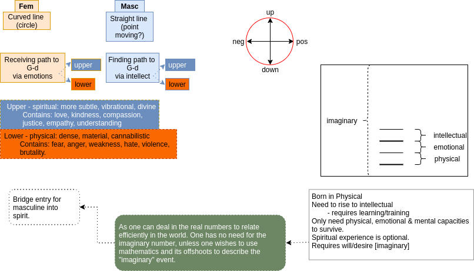

1. [Masculine & Feminine](#masculine--feminine)
   1. [Upper & Lower](#upper--lower)
   2. [Roles](#roles)

# Masculine & Feminine

## Upper & Lower

Instead of looking at ourselves as some sort of "[object](objectification.html)",
as an "ideal" to attain, [an imagined perfection](superior_man.html), as illustrated by Jesus, Buddha, Mother Teresa, and [other significant and influential figures](golden_shadow.html). What if we viewed ourselves and our fellow beings as works-in-progress? Imagine everyone walked around with an "under construction" sign. Because who dies completely fulfilled? There is always something or, if you are lucky, someone left behind.

Why not look at ourselves, our world, in fact the whole darn universe, as dynamic systems. Systems that are always in some sort of flux, some of which is obvious and some of which is not. There is so much that happens, and that could happen, that we are unaware of, and that affect us. We are like fish in the ocean. All we can do, as regards the ocean itself, is just live in it and with it. We can search for food, and harvest what we can from our surroundings - but the currents that bring the nourishment, and the sun that nurtures them, and the many complex events that have to occur in order for this food to arrive and this current to flow is beyond anything we can imagine, and this flux affects us, even if we are seemingly still "who we were".

Even in our lives we think we are a constant, and not in constant flux. Besides the fact that our body is, our emotions are, and our mind is constanly breathing, feeling and thinking. How balanced they are depends on a number of factors, but training and practice is at their core. But as we grow, we move from one "type" of person to another. I am not the toddler I was when I was born. I have grown from being the young boy I was cavorting around the garden. I am not longer the father I was to my young children. Although I might still be, and always will be, their father, I am not longer the father I was then, for they are grown with their own children. And so it goes on - till I die.

## Roles

> For the masculine it is about achieving something - and then he will be satisfied/happy. For the feminine is it about being in love & happy.

The "success" that the masculine achieves has to be constantly maintained and monitored. The more he achieves, the more attention these will demand from him. And one of the main tools of the _Sitra Achra_, the evil impulse, is to keep us occupied in the realm of the mundane so that we have no time to spend in the realm of the divine. That is to say that most of our day is taken up with mundane activities, most of our goals are empirical, and very little, if any, of our day is devoted to our relationship with the Divine. How many of your daily thoughts are taken up in contemplating what we don't know, what is not there? Being still and listening silent speech, rather than thinking and about the things and experiences and events of your own life?

A man must learn to respond, then he must practise responding in a constrained and balanced fashion. The woman must learn to contain her responses, and choose the appropriate responses, and, interestingly, the appropriate time to respond.

The role of the woman is well-defined, as the role of the man needs to be. The better defined that each role of the masculine is, the easier it is for the woman to be secure in her place.

> - **Love** without vulnerability is not love at all

Love, too, needs constant nourishment, though we know that material things are not what love needs - though gifts are always lovely. Admittedly, both men and women desire a materially comfortable life, that is not under question. And achieving that is a worthwhile goal. However, it is not sufficient to nourish love, though it might be sufficient to assuage the masculine, it certainly will leave the feminine in exile.

## Desire for Power

> The desire for power, greed, is a feminine trait. It devours whatever it can, an unbalanced form of receiving.
