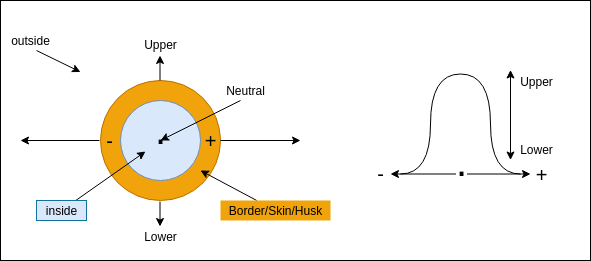

1. [Stillness](#stillness)
2. [Trines](#trines)
   1. [Trinity](#trinity)
   2. [Three's](#threes)
   3. [3 shapes](#3-shapes)
3. [As above, so below (AASB)](#as-above-so-below-aasb)
   1. [Upper & Lower](#upper--lower)
4. [Help](#help)

## Stillness

> **Absolute and total stillness**: If something is still, it cannot be observed. Thus everything can be measured/perceived if and when it moves.

Absolute stillness is absolute form - what is also referred to as "dead matter", though essentially all that we refer to as matter, is dead in our minds. The dead tree - which we call now wood - can be burnt, bent, hacked and carved to our desire - for it is "dead". A steak - which is meat from a once sentient being, and we know refer to as "meat" - which itself is dead matter ready to be consumed. And to add the coup de gra, we burnt it before consuming it.

Only form can deplete energy as well. In fact, it needs to consume energy to stay "in form". [J: Just as we need in-form-ation to remain in-form-ed about our form! ]

## Vesica Pisces

### Trinity

### Three's

3 states, 3 responses, 3 reactions: positive, negative & neutral; for, against, not-sure; pro, anti, on the fence; beginning ($$1$$), end ($$\infty$$), middle&mdash;which is everything inbetween, and forms the "visible" segment.

One could also term in masculine, feminine, and the {[Vesica Pisces](vesica_pisces.html)} as the interface described between the two.

Two ways to deal with the middle: [Excluded middle](/posts/qkab/middle/) (used mainly in mathematics, and logic, and fascist regimes), or the [included middle](/posts/qkab/middle/).

However, the boundaries of the space are defined (expressed) by the extremes (or the limits/boundaries). Thus is it the extremists, what we call the fanatics, or zealots, that pull society this way or that.

### 3 shapes

Every object produces at least three shapes: inner, outer and the border.

The inner represents the observer, the I, and the outer represents the observed, the situation. The border, or skin, demarcates a field of "awareness"/interaction - what we might refer to today as entanglement.

## As above, so below (AASB)

## Upper & Lower

There must be differences, otherwise things would be indistinguishable.Unless they are separated by a "brane", a curtain or barrier, that keeps them separate, though they are the same - without even realising it - for they just percieve one another through their "branes" [both membraInes and braIns (which are "branes with an I in them!).] There may be many differences, but they are so intertwined in one space, that it is impossible to tell where the one begins and the other ends. However, at some point, which we referred as the _klipah_ there is a difference. So we can accept the idea that there is a difference, and/or some sort of separation between the This and the That - in this case the Upper and the Lower.

Or perhaps it behaves more like the photons in the double slit experiment, where each ray can follow any path to the upper realm, but collapses to certain one’s because of what the consciousness in the lower realm is “observing”.

### Upper & Lower

Yet, if there are differences between U & L, what are they?
One is that U has info that is essential for us to “heal” ourselves – and attain our inheritance.

This is where they connect. What is the point, the primal point of what you are doing, or the event, or the words you use? Are they feeding the upper realms, or strengthening the Lower? Our sages say that good is a choice, while evil is natural.

We have the ability, nay, the incredible gift and responsibility to affect each and everyone’s life by taking control of our own lives. Whatever one says regarding us, as human beings, whatever the comparisons one makes with the stars or the beasts, with virii or computers, we are the only living beings that are able to are consciously conscious, as far as we know. We are the only one’s we know of that make conscious and premeditated steps to control our behaviour. Even a star has no say in its destiny. The sages call this “free will”, and say that we always have a choice to do good – which generally entails going against our “natural” desires, and shaping them consciously.

## Help

However, if it is true that AASB, then we cannot look to the upper realms for help as they must be in the same chaotic and unsafe state that we are in. Appealing to “them”, the Upper, would, in that case, be useless. We have to solve our own problems.

There is another possibility. That some "hero" will descend from above and save us all... We call him the Messiah - which actually also means messenger.
=======
---

## Three(s)

3 states, 3 responses, 3 reactions: positive, negative & neutral; for, against, not-sure; pro, anti, on the fence; beginning (1), end (infinity), middle (which forms the bulk).

Two ways to deal with the middle: Excluded middle (used mainly in mathematics, and logic, and fascist regimes), or the included middle.

However, the boundaries of the space are defined (expressed) by the extremes (or the limits/boundaries). Thus is it the extremists, what we call the fanatics, or zealots, that pull society this way or that.

## Sovereignty ~ empowerment

> There is no real sovereignty. The only real sovereign is G-d. The only earthly sovereignty we experience, is as power over. What we can seek only in the societal environment, is "empowerment".
>>>>>>> a2376e4 (More posts)
