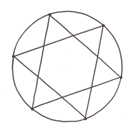
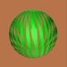
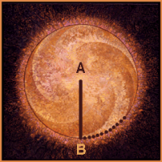

Publication in Class C

## 1–9

<figure>
  
  <figcaption>The numbers 1–9 tell the story of
the creation of the material
world.</figcaption>
</figure>

 

Images this section: <http://www.divinetemplatecreations.com/sacred_geometry/1-9.html>

### 1

<figure style='float: left'>
  
</figure>

The 1 is the point from which the circle arises; representative of **Kether** on the Tree-of-Life. The point at its center is that singularity in the whole (circle) of the Universe and the oneness from which the whole of creation emanates. The circle is the foundation from which all the other forms are built.

The Kabbalists expanded this idea of Nothing, which they called _"Ain Soph"_-"Without Limit". (This idea seems not unlike that of Space.) They then decided that in order to interpret this mere absence of any means of definition, it was necessary to postulate the _Ain Soph Aur_-"Limitless Light". By this they seem to have meant very much what the late Victorian men of science meant, or thought that they meant, by the Luminiferous &AElig;ther. (The Space-Time Continuum?)

All this is evidently without form and void. The next idea must be that of Position. One must formulate this thesis: If there is anything except Nothing, it must exist within this Boundless Light; within this Space; within this inconceivable Nothingness, which cannot exist as Nothing-ness, but has to be conceived of as a Nothingness composed of the annihilation of two imaginary opposites. Thus appears The Point, which has "neither parts nor magnitude, but only position".

But position does not mean anything at all unless there is something else, some other position with which it can be compared. One has to describe it. The only way to do this is to have another Point, and that means that one must invent the number Two, making possible The Line.

 

### 2

<figure style='float: left'>
  
</figure>

The 2 is the line; the connection of two points that divides the circle, as a cell splits in reproduction, and creation begins. Two is the duality that is the nature of the Universe wherein we dwell. In the Kabbalah, it is the second letter that is the foundation upon which the world is built.

"But this Line does not really mean very much, because there is yet no measure of length. The limit of knowledge at this stage is that there are two things, in order to be able to talk about them at all. But one cannot say that they are near each other, or that they are far apart; one can only say that they are distinct. In order to discriminate between them at all, there must be a third thing. We must have another point. One must invent The Surface; one must invent The Triangle. In doing this,  incidentally, appears the whole of Plane Geometry. One can now say, 'A is nearer to B than A is to C'."

 

### 3

<figure style='float: left'>
  
</figure>

The 3 is the triangle and as the first shape to create a surface, represents the movement away from one-dimensional reality to two-dimensional reality. Note the triangle represents the strongest structure in nature. Philosophically, it represents the dialectic; point,
counter-point and conclusion.

 

### 4

<figure style='float: left'>
  
</figure>

The 4 is the square, which offers support and stability through its even, balanced shape. It is the fourth point; representing the solid as a departure is made from two- into three-dimensional reality. This is reflected in a four-fold nature (the space-time continuum) on the Earth with: 4 seasons, 4 directions, 4 phases of the Moon, 4 elements (Earth, Air, Fire, Water).

 

### 5

<figure style='float: left'>
  
</figure>

The 5 is the pentagram (an ancient symbol of regeneration and transformation) and a fifth principal; postulated as motion. It is also a symbol of the human form, with head, arms, and legs outstretched, welcoming experience. It is through our 5 senses that we navigate
the material world.

 

### 6

<figure style='float: left'>
  
</figure>

Movement implies consciousness; represented by the sixth _Sefirah_ (**Tifereth**) on the Tree-of-Life. The 6 is the Star of David, two perfectly balanced, interlocking equilateral triangles. It gives us the axiom: _'As above, so below'_; the uniting of spiritual plane with the material plane. It is the number of God (1) in man (5).

"[The fifth point; motion] implies the idea of Time, for only through Motion, and in Time, can any event happen. Without this change and sequence, nothing can be the object of sense. (It is to be noticed that this No.5 is the number of the letter _'he'_ in the Hebrew alphabet. This is the letter traditionally consecrated to the Great Mother. It is the womb in which the Great Father, who is represented by the letter '_yod_' which is pictorially the representation of an ultimate Point, moves and begets active existence).

There is now possible a concrete idea of the Point; and, at last it is a point which can be self-conscious, because it can have a Past, Present and Future. It is able to define itself in terms of the previous ideas. Here is the number Six, the centre of the system, self-conscious and capable of experience.

 

### 7

<figure style='float: left'>
  
</figure>

The 7 (_Sat_, the Essence of Being itself) is the most sacred of numbers; represented in cosmology by the seven sacred planets and reflected into the seven days of the week. The 7 relates to cycles of time and the movement of the sun and the planets as seen from Earth. Seven is also the sacred vibration found in the numeration of the chakras and the musical scale.
 

### 8

<figure style='float: left'>
  
</figure>

The 8 (_Chit_, Thought, or Intellection) is the octagon, the intermediate form between the circle (Heaven) and the square (Earth). As the 4 doubled, it is the number of ascension above the material world through spiritual perspective. The 8th step on the musical scale is the octave, which brings harmonic resonance and a sense of fulfilment.

 

### 9

<figure style='float: left'>
  
</figure>

The 9 (_Ananda_; translated as Bliss, being the pleasure experienced by Being in the course of events) is the completion of the creative cycle; represented by the Astral Plane Magick. It brings attainment, compassion, and vision for the future through the wisdom gleaned from the journey through the other numbers. However the 9 is not an endpoint, but merely the closing of the circle, carrying us back to the 1 to begin the next evolution.

 

## General Figures

### The Sphere

While the sphere may be one of the simplest forms in sacred geometry, it is also the container that can hold all of the other forms. All measurements are equal in a sphere. It is a figure that is complete in its entirety. The earth, a seed, and an atom are all spheres.

  

    <figure style='float: left'>
      
    </figure>

The sphere looks like the surface of a ball
  

  

<figure>
  <figure style='float: left'>
  
</figure>
The sphere has been cut in half to show that it is not solid.

  

  <figure>
    <figure style='float: left'>
    
  </figure>
Bands of the sphere have been removed.
  

 

### The Circle

A circle is another simple form found in sacred geometry. The circle is two dimensional and is a symbol of oneness. The ratio of the circumference of a circle to its diameter is called Pi, written with the symbol '**&pi;**'. Pi is an irrational number and never ends nor does it ever repeat. It is infinite.

### The Single Point

  <figure>
    <figure>
    
  </figure>

The Single Point is the first archetype of Sacred Geometry. It is directly related to unity consciousness or Oneness... undivided God Mind.
The Single Point is the absolute root mental concept... the simplest idea possible. It is literally The First Dimension... the omnipresent / omnipotent center.
Single Pointedness is the root of all holistic thinking.... THE ALL IS ONE.
Single Pointedness or Oneness, is that which is beyond Duality

  <figure>
    <figure>
    
  </figure>

The two dimensional Universe begins in the division of The Single Point. This is The Great Mystery of Sacred Geometry: The Single Point
magically divides and becomes The Two Points. The Universe is created by this division: unity becomes duality. This is the great miracle and
mystery. Suddenly, Point A. is here and Point B.  is there.
These two points, this first duality, marks the first architectural relationship of the Universe and creates the first abstract unit of measure, i.e., space. The Second Dimension literally begins at this conceptual level: The Two Points.

  <figure>
    <figure>
    
  </figure>

The tremendous energies contained within this first two dimensional relationship of the Universe (The Two Points) manifests as a duality of motion: straight line motion (from Point A. to Point B.) and rotational
motion (Point B. around Point A.). This dual movement is called The Radius/Arc.
This is the conceptual Big Bang. All the various energies of the universe trace to the play between the Radius and the Arc. The Radius/Arc is Yin and Yang, Light and Dark, Left and Right, Father and Mother, etc. All manifestations of duality trace to The Radius/Arc.

  <figure>
    <figure>
    
  </figure>

The timeless relationship forever held within The Radius/Arc (expressed scientifically as Pi) is THE root mathematical formula and visually unfolds to become the first enclosed form of Sacred Geometry, the Circle .
The Circle is unity, Oneness. It is the two dimensional manifestation of single pointedness, undivided God Mind. The Circle is... THE ALL. This is the essence of Mandala; The Circle holds ALL.
Definition: Pi: The ratio of the circumference of the circle to its diameter: an irrational number having a value to eight places of 3.14159265. For practical purposes, the value of Pi is 3.1416.

  <figure>
    <figure>
    
  </figure>

The first Icon (The Circle) is created by rotating point B. around point A. (the yellow circle).
But The Two Points, are perfect twins with equal potentials, and Point A. can also rotate around point B using the original radius. This natural polarity, this reversal of rolls, produces another circle (the violet one).
These two circles create the second enclosed form (overlapping) of Sacred Geometry entitled The Two Circles Of Common Radius.

  <figure>
    <figure>
    
  </figure>

These two overlapping circles with a common radius, create the third enclosed form of Sacred Geometry. The ancients called this archetype The Vesica Piscis (black shape).
ALL the dimensional forms of this cosmos evolve from this football like shape... literally ALL form. The Vesica Piscis is literally the womb of the
universe.... the ever unfolding Mother of Sacred Geometry.

  <figure>
    <figure>
    
  </figure>

In addition to The Vesica Piscis, The Two Circle Of Common Radius create two new points at their intersections (C & D).
The play of Father/Mother points (A and B) create the first children of the universe: The twins (points C & D). And the magnification continues.

  <figure>
    <figure>
    
  </figure>

Rotating the first two points (A & B) around these new points (C & D) creates two additional circles and four additional Vesica Piscii. Now we have Four circles of common radius and Five Vesica Piscii (see Fig 8).
The two new circles also create four more points (E, F, G, & H.), and another enclosed form of Sacred Geometry we call, The Petal (the white shape at the center).
This is the germ of The Creation Pattern, as all of the necessary forms are now in place: Parents (circles 1 & 2) and children (circles 3 & 4). This is the essence of family revealed in Sacred Geometry.... the family
heart in the form of a petal.
And the magnification is about to explode!

  <figure>
    <figure>
    
  </figure>

Striking more circles around the new points (E. F. G. & H.) compounds the forms and creates a never ending grid of Circles, Vesica Piscii, and Petals entitled Nature's First Pattern. This is an ever evolving two dimensional pattern which, at the conceptual level, circumnavigates the universe.

Nature's First Pattern is THE creation pattern.

There are an infinite number of sub patterns and forms to be discovered within Nature's First Pattern, and the study of these unlimited possibilities IS the root two dimensional study of Sacred Geometry.

### The Point

<figure>
  
  <figcaption></figcaption>
</figure>

The point is found at the center of the sphere or the circle. All measurements must either begin with the point or pass through the point. It is the beginning and it is the end. In sacred geometry the center point is thought to be the place creation began.

### The Square Root of 2

The square root of 2 is an irrational number. When a square with sides that measure one unit is divided diagonally, the square root of 2 is the length of the diagonal. Like Pi, square root of 2 never ends. The total of the square root of 2 equals more than half of itself.

### The Golden Ratio

The golden ratio, or phi, is the unique ratio in which the ratio of the larger portion is equal to the ratio of the smaller portion. The golden ratio is another irrational number. It is usually rounded to 1.618. It is also known as the golden mean, divine proportion, or golden section. The golden ratio has been used since ancient time in architecture of buildings.

The golden ratio, also known as the divine proportion, golden mean, or golden section, is a number often encountered when taking the ratios of distances in simple geometric figures such as the pentagram, decagon and dodecahedron. It is denoted abbreviation of the Greek "tome," meaning "to cut". It is denoted by &phi;, or sometimes &tau; (which is an abbreviation of the Greek "tome", meaning "to cut".)

The term "golden section" (_goldene Schnitt_) seems to first have been used by Martin Ohm in the 1835 2nd edition of his textbook _Die Reine Elementar-Mathematik_ (Livio 2002, p. 6). The first known use of this term in English is in James Sulley's 1875 article on aesthetics in the
9th edition of the Encyclopedia Britannica. The symbol ("phi", $$\phi$$) was apparently first used by Mark Barr at the beginning of the 20th century in commemoration of the Greek sculptor Phidias (ca. 490-430 BC), who a number of art historians claim made extensive use of the golden ratio in his works (Livio 2002, pp. 5-6).

&phi; has surprising connections with continued fractions and the Euclidean algorithm for computing the greatest common divisor of two integers. It is also a so-called Pisot Number.

<figure style='float: left'>
  
  <figcaption></figcaption>
</figure>

Given a rectangle having sides in the ratio, is defined such that partitioning the origin rectangle into a square and new rectangle results in a new rectangle having sides with a rati

. Such a rectangle is called a golden rectangle, and successive points dividing a golden rectangle into squares lie on a logarithmic spiral. This figure is known as a whirling square. The legs of a golden triangle (an isosceles triangle with a vertex angle of ) are in a golden
ratio to its base and, in fact, this was the method used by Pythagoras to construct .

The ratio of the circumradius to the length of the side of a decagon is also ,

Bisecting a (schematic) Gaullist cross also gives a golden ratio (Gardner 1961, p. 102). Euclid ca. 300 BC defined the "extreme and mean ratios" on a line segment as the lengths such that

(Livio 2002, pp. 3-4). Plugging in,

and clearing denominators gives

(Incidentally, this means that is a algebraic number of degree 2.) So, using the quadratic equation and taking the positive sign (since the figure is defined so that
=

=
(Sloane's A001622).

Exact trigonometric formulas for include

=
=

=

The golden ratio is given by the infinite series

> 1),

(B. Roselle). Another fascinating connection with the Fibonacci numbers is given by the infinite series

A representation in terms of a nested radical is

(Livio 2002, p. 83).

is the "most" irrational number because it has a continued fraction representation

(Sloane's A000012; Williams 1979, p. 52; Steinhaus 1999, p. 45; Livio 2002, p. 84). This
means that the convergents are given by the quadratic recurrence equation

with X1=1, which has solution

where F2 is the nth Fibonacci number. As a result,

as first proved by Scottish mathematician Robert Simson in 1753 (Wells 1986, p. 62; Livio
2002, p. 101).

Let the continued fraction of be denoted and let the denominators of the
convergents be denoted , , ..., . As can be seen from the plots above, the regularity in
the continued fraction of means that is one of a set of numbers of measure 0 whose
continued fraction sequences do not converge to the Khinchin constant or the Khinchin-Lévy
constant.
The golden ratio has Engel expansion 1, 2, 5, 6, 13, 16, 16, 38, 48, 58, 104, ... (Sloane's
A028259).
The golden ratio also satisfies the recurrence relation

Taking h =1 gives the special case

Treating (◇) as a linear recurrence equation

in

(h) =

h

, setting

(0) =1 and

(1) =

, and solving gives

as expected. The powers of the golden ratio also satisfy

where is a Fibonacci number (Wells 1986, p. 39)
The sine of certain complex numbers involving gives particularly simple answers, for
Example
=

=
(D. Hoey, pers. comm.). A curious (although not particularly useful) approximation due to D
Barron is given by

where is Catalan's constant and is the Euler-Mascheroni constant, which is good to two
digits.

In the figure above, three triangles can be inscribed in the rectangle A B C D of arbitrary
aspect ratio 1: r such that the three right triangles have equal areas by dividing A B and B C
in the golden ratio. Then
=

=
=

which are all equal.

The substitution map
0

01

1

0

Gives

giving rise to the sequence

(Sloane's A003849). Here, the zeros occur at positions 1, 3, 4, 6, 8, 9, 11, 12, ... (Sloane's
A000201), and the ones occur at positions 2, 5, 7, 10, 13, 15, 18, ... (Sloane's A001950).
These are complementary Beatty sequences generated by and . The sequence als
has many connections with the Fibonacci numbers.

Steinhaus (1983, pp. 48-49) considers the distribution of the fractional parts of in the
intervals bounded by 0, 1 /h, 2/h, ..., (h-1)/h, 1, and notes that they are much more
uniformly distributed than would be expected due to chance (i.e., is close to an
equidistributed sequence). In particular, the number of empty intervals for h=1, 2, ..., are
mere 0, 0, 0, 0, 0, 0, 1, 0, 2, 0, 1, 1, 0, 2, 2, ... (Sloane's A036414). The values of for
which no bins are left blank are then given by 1, 2, 3, 4, 5, 6, 8, 10, 13, 16, 21, 34, 55, 89,
144, ... (Sloane's A036415). Steinhaus (1983) remarks that the highly uniform distribution
has its roots in the continued fraction for

.

h

The sequence {frac (x )}, of power fractional parts, where is the fractional part, is
equidistributed for almost all real numbers x>1, with the golden ratio being one exception.
Salem showed that the set of Pisot numbers is closed, with the smallest accumulation point of
the set (Le Lionnais 1983).
SEE ALSO: Beraha Constants, Decagon, Equidistributed Sequence, Euclidean Algorithm, Five
Disks Problem, Golden Angle, Golden Gnomon, Golden Ratio Conjugate, Golden Rectangle,
Golden Triangle, Icosidodecahedron, Noble Number, Pentagon, Pentagram, Phi Number
System, Phyllotaxis, Pisot Number, Power Fractional Parts, Ramanujan Continued Fractions,
Rogers-Ramanujan Continued Fraction, Secant Method.

According to legend, the Greek Philosopher Pythagoras discovered the concept of harmony
when he began his studies of proportion while listening to the different sounds given off when
the blacksmith's hammers hit their anvils. The weights of the hammers and of the anvils all gave
off different sounds. From here he moved to the study of stringed instruments and the different
sounds they produced. He started with a single string and produced a monochord in the ratio of
1:1 called the Unison. By varying the string, he produced other chords: a ratio of 2:1 produced
notes an octave apart. (Modern music theory calls a 5:4 ratio a "major third" and an 8:5 ratio a
"major sixth".) In further studies of nature, he observed certain patterns and numbers
reoccurring. Pythagoras believed that beauty was associated with the ratio of small integers.

Astonished by this discovery and awed by it, the Pythagoreans endeavored to keep this a secret;
declaring that anybody that broached the secret would get the death penalty. With this discovery,
the Pythagoreans saw the essence of the cosmos as numbers and numbers took on special
meaning and significance.
The symbol of the Pythagorean brotherhood was the pentagram, in itself embodying several
Golden Means.
The Greeks, who called it the Golden Section, based the entire design of the Parthenon
on this proportion.
The Greeks knew
it as the

Golden Section

and used it for beauty
and balance in the
design of architecture

Phidias (500 BC - 432 BC), a Greek sculptor and mathematician, studied phi and
applied it to the design of sculptures for the Parthenon.

Porch of Maidens, Acropolis, Athens

Euclid proved that the diagonals of the regular pentagon cut each other in "extreme and mean
ratio", now more commonly known as the golden ratio. Here we represent the golden ratio by
phi. Fn is the nth Fibonacci number.

The Square Root of 3 and the Vesica Piscis
The square root of 3 is a positive real number. When it is multiplied by itself it equals 3. The
vesica picis is the name for the almond shaped area that is created when two circles of the same
radius which intersect so that each circle lies within the circumference of the other. The
geometric ratio of the almond space area is the square root of 3. It is considered to be the symbol
for Jesus, part of the Ark of the Covenant along with other sacred meanings.

The square root of 3 is the positive real number that, when multiplied by itself, gives the
number 3.
The first sixty significant digits of its decimal expansion are:
1.73205 08075 68877 29352 74463 41505 87236 69428 05253 81038 06280 5580...
The rounded value of 1.732 is correct to within 0.01% of the actual value.
The VESICA PISCIS

The oval form of the VIII° symbol is of great significance and has been known for many centuries as the Vesica
Piscis, or fish's bladder, probably to conceal its true meaning.
If we go back to the early stages of symbolism we find the circle used to represent eternity, and to man's conception,
there are two eternities; that of the ages past, and that of the future. Two equal circles would symbolize these infinite
periods of time and their intersection forms a cavity, which represents that attainment, which is the aim and object of
every man's sojourn on this earth, and which in Christian symbolism, is called the birth and life of Christ in the soul.
The Vesica Piscis is an almost universal symbol for the Christ and this accounts for the use of the oval form on seals
of ecclesiastical institutions.

The early Christians were anxious to include symbols of their religion in their cathedrals and churches, and this is
the reason for the rise of Gothic architecture in which the windows were built in a pointed form to include this
symbol of the Christ.
As the new covenant of the Avatar Jesus is said to have superseded that of Moses, so do we find the Christian
degrees in Masonry beyond the craft or universal degrees, and in the same way Gothic architecture came after the
square or Norman type.
The diagram shown above is the figure for the first proposition of the first book of Euclid, and all the subsequent
propositions depend upon this fundamental one, which is to describe an equilateral triangle on a given line. When
described in this way, the triangle forms a fitting symbol of the Christian Trinity.
If we enclose the Vesica Piscis in a rectangle, and divide that rectangle into three equal parts as shown in Fig. 2, we
find that the ratio of the sides of one of the smaller triangles is equal to the ratio of the sides of the whole rectangle.
In other words, the ratio of AB to AD is the same as the ratio of AD to AC, which ratio is that of 1 to the square root
of 3. This is very important and significant fact and makes the symbol particularly referable to the Triune God.
This fact was evidently known to the builders of the Middle Ages for we find that the naves of many of the old
cathedrals and churches were built with their sides in this same proportion. Rosslyn Chapel, in England is a famous
example of this ratio.

Spirals
There are a number of different types of spirals. There are flat spirals, 3-D spirals, right-handed
spirals, left-handed spirals, equi-angular spirals, geometric spirals, logarithmic spirals and
rectangular spirals. The most well known spiral is that of the nautilus shell. All spirals have two
things in common: expansion and growth. They are symbols of infinity.
Equiangular Spiral

A equiangular spiral and its secants.

History

Want to learn differential equations? Our conceptual approach is your best bet. Visit Differential
Equations, Mechanics, and Computation

The investigation of spirals began at least with the ancient Greeks. The famous Equiangular
Spiral was discovered by Rene Descartes, its properties of self-reproduction by Jacob Bernoulli
(1654-1705) (aka James or Jacques) who requested that the curve be engraved upon his tomb
with the phrase ―Eadem mutata resurgo‖ (―I shall arise the same, though changed.‖) [Source:
Robert C Yates (1952)]
The equiangular spiral was first considered in 1638 by Descartes, who started from the property s
= a.r. Evangelista Torricelli, who died in 1647, worked on it independently and used for a
definition the fact that the radii are in geometric progression if the angles increase uniformly.
From this he discovered the relation s = a.r; that is to say, he found the rectification of the curve.
Jacob Bernoulli, some fifty years later, found all the ―reproductive‖ properties of the curve; and
these almost mystic properties of the ―wonderful‖ spiral made him wish to have the curve incised
on his tomb: Eadem mutata resurgo — ―Though changed I rise unchanged‖. [source: E H
Lockwood (1961)]
Description

Equiangular spiral describes a family of spirals of one parameter. It is defined as a curve that cuts
all radial line at a constant angle.
It also called logarithmic spiral, Bernoulli spiral, and logistique.
Explanation:

1. Let there be a spiral (that is, any curve r==f[θ] where f is a monotonic inscreasing function)
2. From any point P on the spiral, draw a line toward the center of the spiral. (this line is called the
radial line)
3. If the angle formed by the radial line and the tangent for any point P is constant, the curve is a
equiangular spiral.

A example of equiangular spiral with angle 80°.
A special case of equiangular spiral is the circle, where the constant angle is 90°.

Equiangular spirals with 40°, 50°, 60°, 70°, 80° and 85°. (left to right) Equiangular Spiral
Formulas

Let α be the constant angle.
Polar: r == E^(θ *Cot[α]) equiangular_spiral.gcf
Parametric: E^(t* Cot[α]) {Cos[t],Sin[t]}
Cartesian: x^2 + y^2 == E^(ArcTan[y/x] Cot[α] )

Properties
Point Construction and Geometric Sequence

Length of segments of any radial ray cut by the curve is a geometric sequence, with a multiplier
of E^(2 π Cot[α]).
Lengths of segments of the curve, cut by equally spaced radial rays, is a geometric sequence.

The curve cut by radial rays. The length of any green ray's segments is geometric sequence. The
lengths of red segments is also a geometric sequence. In the figure, the dots are points on a 85°
equiangular spiral.
Catacaustic

Catacaustic of a equiangular spiral with light source at center is a equal spiral.
Proof: Let O be the center of the curve. Let α be the curve's constant angle. Let Q be the
reflection of O through the tangent normal of a point P on the curve. Consider Triangle[O,P,Q].
For any point P, Length[Segment[O,P]]==Length[Segment[P,Q]] and Angle[O,P,Q] is constant.
(Angle[O,P,Q] is constant because the curve's constant angle definition.) Therefore, by argument
of similar triangle, then for any point P, Length[Segment[O,Q]]==Length[Segment[O,P]]*s for
some constant s. Since scaling and rotation around its center does not change the curve, thus the
locus of Q is a equiangular spiral with constant angle α, and Angle[O,Q,P] == α. Line[P,Q] is the
tangent at Q.

Equiangular Spiral Caustic
Curvature

The evolute of a equiangular spiral is the same spiral rotated.
The involute of a equiangular spiral is the same spiral rotated.

Left: Tangent circles of a 80° equiangular spiral. The white dots are the centers of tangent
circles, the lines are the radiuses. Right: Lines are the tangent normals, forming the evolute curve
by envelope. Equiangular Spiral Evolute

Radial

The radial of a equiangular spiral is itself scaled. The figure on the left shows a 70° equiangular
spiral and its radial. The figure on the right shows its involute, which is another equiangular
spiral.

Inversion

The inversion of a equiangular spiral with respect to its center is a equal spiral.

Pedal

The pedal of a equiangular spiral with respect to its center is a equal spiral.

Pedal of a equiangular spiral. The lines from center to the red dots is perpendicular to the
tangents (blue lines). The blue curve is a 60° equiangular spiral. The red dots forms its pedal.
Pursuit Curve

Persuit curves are the trace of a object chasing another. Suppose there are n bugs each at a corner
of a n sided regular polygon. Each bug crawls towards its next neighbor with uniform speed. The
trace of these bugs are equiangular spirals of (n-2)/n * π/2 radians (half the angle of the polygon's
corner).

Left: shows the trace of four bugs, resulting four equiangular spirals of 45°. Above right: six
objects forming a chasing chain. Each line is the direction of movement and is tangent to the
equiangular spirals so formed.

Spiral in nature

Spiral is the basis for many natural growths.

Seashells have the geometry of equiangular spiral. See: Mathematics of Seashell Shapes.

A cauliflower (Romanesco broccoli) exhibiting equiangular spiral and fractal geometry. (Photo
by Dror Bar-Natan. Source)
Spirals




Belousov's Brew. A recipe for making spiraling patterns in chemical reactions.
Equiangular spiral. Properties of Bernoulli's logarithmic 'spiralis mirabilis'.
Fermat's spiral and the line between Yin and Yang. Taras Banakh, Oleg Verbitsky, and Yaroslav
Vorobets argue that the ideal shape of the dividing line in a Yin-Yang symbol is formed, not from
two semicircles, but from Fermat's spiral.






Fourier series of a gastropod. L. Zucca uses Fourier analysis to square the circle and to make an
odd spiral-like shape.
The golden bowls and the logarithmic spiral.
Golden spiral flash animation, Christian Stadler.
Graphite with growth spirals on the basal pinacoids. Pretty pictures of spirals in crystals. (A
pinacoid, it turns out, is a plane parallel to two crystallographic axes.)
Helical Gallery. Spirals in the work of M. C. Escher and in X-ray observations of the sun's corona.
Mathematical imagery by Jos Leys. Knots, Escher tilings, spirals, fractals, circle inversions,
hyperbolic tilings, Penrose tilings, and more.
Log-spiral tiling, and other radial and spiral tilings, S. Dutch.
Looking at sunflowers. In this abstract of an undergraduate research paper, Surat Intasang
investigates the spiral patterns formed by sunflower seeds, and discovers that often four sets of
spirals can be discerned, rather than the two sets one normally notices.
Modeling mollusc shells with logarithmic spirals, O. Hammer, Norsk Net. Tech. Also includes a
list of logarithmic spiral links.
Pi curve. Kevin Trinder squares the circle using its involute spiral. See also his quadrature based
on the 3-4-5 triangle.
Pictures of various spirals, Eric Weeks.
Polyform spirals.
Ram's Horn cardboard model of an interesting 3d spiral shape bounded by a helicoid and two
nested cones.
Research: spirals, Mícheál Mac an Airchinnigh. Presumably this connects to his thesis that "there
is a geometry of curves which is computationally equivalent to a Turing Machine".
Seashell spirals. Xah Lee examines the shapes of various real seashells, and offers prize money
for formulas duplicating them.
Soddy Spiral. R. W. Gosper calculates the positions of a sequence of circles, each tangent to the
three previous ones.
Spidron, a triangulated double spiral shape tiles the plane and various other surfaces. With
photos of related paperfolding experiments.
Spira Mirabilis logarithmic spiral applet by A. Bogomily.
Spiral generator, web form for creating bitmap images of colored logarithmic spirals.




Spiral in a liquid crystal film.
Spiral minaret of Samara.


































A spiral of squares with Fibonacci-number sizes, closely related to the golden spiral, Keith
Burnett. See also his hand-painted Taramundi spiral.
Spiral tea cozy, Kathleen Sharp.
Spiral tilings. These similarity tilings are formed by applying the exponential function to a lattice
in the complex number plane.

Spiral tower. Photo of a building in Iraq, part of a web essay on the geometry of cyberspace.
Spiral triangles, Eric Weeks.
Spiraling Sphere Models. Bo Atkinson studies the geometry of a solid of revolution of an
Archimedean spiral.
Spirals. Mike Callahan and Larry Shook use a spreadsheet to investigate the spirals formed by
repeatedly nesting squares within larger squares.
Spirals and other 2d curves, Jan Wassenaar.
Spring into action. Dynamic origami. Ben Trumbore, based on a model by Jeff Beynon from
Tomoko Fuse's book Spirals.
These two pictures by Richard Phillips are from the now-defunct maths with photographs
website. The chimney is (Phillips thinks) somewhere in North Nottinghamshire, England. A
similar collection of Phillips' mathematical photos is now available on CD-ROM.

Three spiral tattoos from the Discover Magazine Science Tattoo Emporium.
The uniform net (10,3)-a. An interesting crystal structure formed by packing square and
octagonal helices.



Wonders of Ancient Greek Mathematics, T. Reluga. This term paper for a course on Greek
science includes sections on the three classical problems, the Pythagorean theorem, the golden
ratio, and the Archimedean spiral.

Toroids

A toroid is a circular shaped object, such as an o-ring. It is formed through repeated circular
rotations. Each circle meets in the center of the toroid. A popular childhood toy, a spirograph,
can be used to create one.

Rotating a circle about a line tangent to it creates a torus, which is similar to a donut shape where
the center exactly touches all the "rotated circles." The surface of the torus can be covered with 7
distinct areas, all of which touch each other; an example of the classic "map problem" where one
tries to find a map where the least number of unique colors are needed. In this 3-dimensional
case, 7 colors are needed, meaning that the torus has a high degree of "communication" across its
surface. The image shown is a

Dimensionality
We see things in either 2 or 3 dimensions. But what about a 4th dimension? Physics debates
whether we exist within 3 or 4 dimension. Sacred geometry takes all 4 dimensions into
consideration.
The progression from point (0-dimensional) to line (1-dimensional) to plane (2-dimensional) to
space (3-dimensional) and beyond leads us to the question - if mapping from higher order
dimensions to lower ones loses vital information (as we can readily observe with optical illusions
resulting from third to second dimensional mapping), does our "fixation" with a 3-dimensional
space introduce crucial distortions in our view of reality that a higher-dimensional perspective
would not lead us to?
Fractals and Recursive Geometries
Fractals are a relatively new form of mathematics, beginning only in the 17th century. A good
example of a fractal form is a fern. Each leaf on a fern is made up of smaller leaves that have the
same shape of the larger whole. In recursive geometry the formula making up a form can be used
repeatedly.
Most physical systems of nature and many human artifacts are not regular geometric shapes of
the standard geometry derived from Euclid. Fractal geometry offers almost unlimited ways of
describing, measuring and predicting these natural phenomena. But is it possible to define the
whole world using mathematical equations?
This article describes how the four most famous fractals were created and explains the most
important fractal properties, which make fractals useful for different domain of science.
Fractals' properties
Two of the most important properties of fractals are self-similarity and non-integer dimension.
What does self-similarity mean? If you look carefully at a fern leaf, you will notice that every
little leaf
the fern leaf is self-similar. The same is with fractals: you can magnify them many times and
after every step you will see the same shape, which is characteristic of that particular fractal.
The non-integer dimension is more difficult to explain. Classical geometry deals with objects of
integer dimensions: zero dimensional points, one dimensional lines and curves, two dimensional
plane figures such as squares and circles, and three dimensional solids such as cubes and spheres.
However, many natural phenomena are better described using a dimension between two whole
numbers. So while a straight line has a dimension of one, a fractal curve will have a dimension
between one and two, depending on how much space it takes up as it twists and curves. The
more the flat fractal fills a plane, the closer it approaches two dimensions. Likewise, a "hilly
fractal scene" will reach a dimension somewhere between two and three. So a fractal landscape

made up of a large hill covered with tiny mounds would be close to the second dimension, while
a rough surface composed of many medium-sized hills would be close to the third dimension.
There are a lot of different types of fractals. In this paper I will present two of the most popular
types: complex number fractals and Iterated Function System (IFS) fractals.
Complex number fractals
Before describing this type of fractal, I decided to explain briefly the theory of complex
numbers.
A complex number consists of a real number added to an imaginary number. It is common to
refer to a complex number as a "point" on the complex plane. If the complex number is
, the coordinates of the point are a
imaginary axis).
The unit of imaginary numbers:

b

.

Two leading researchers in the field of complex number fractals are Gaston Maurice Julia and
Benoit Mandelbrot.
Gaston Maurice Julia was born at the end of 19th century in Algeria. He spent his life studying
the iteration of polynomials and rational functions. Around the 1920s, after publishing his paper
on the iteration of a rational function, Julia became famous. However, after his death, he was
forgotten.
In the 1970s, the work of Gaston Maurice Julia was revived and popularized by the Polish-born
Benoit Mandelbrot. Inspired by Julia's work, and with the aid of computer graphics, IBM
employee Mandelbrot was able to show the first pictures of the most beautiful fractals known
today.
Mandelbrot set
The Mandelbrot set is the set of points on a complex plain. To build the Mandelbrot set, we have
to use an algorithm based on the recursive formula:
,
separating the points of the complex plane into two categories:



points inside the Mandelbrot set,
points outside the Mandelbrot set.

The image below shows a portion of the complex plane. The points of the Mandelbrot set have
been colored black.

It is also possible to assign a color to the points outside the Mandelbrot set. Their colors depend
on how many iterations have been required to determine that they are outside the Mandelbrot set.

How is the Mandelbrot set created?
To create the Mandelbrot set we have to pick a point (C ) on the complex plane. The complex
number corresponding with this point has the form:
After calculating the value of previous expression:

using zero as the value of
result to

, we obtain C as the result. The next step consists of assigning the

and repeating the calculation: now the result is the complex number

we have to assign the value to

and repeat the process again and again.

. Then

This process can be represented as the "migration" of the initial point C across the plane. What
happens to the point when we repeatedly iterate the function? Will it remain near to the origin or
will it go away from it, increasing its distance from the origin without limit? In the first case, we
say that C belongs to the Mandelbrot set (it is one of the black points in the image); otherwise,
we say that it goes to infinity and we assign a color to C depending on the speed at which the
point "escapes" from the origin.
We can take a look at the algorithm from a different point of view. Let us imagine that all the
points on the plane are attracted by both: infinity and the Mandelbrot set. That makes it easy to
understand why:




points far from the Mandelbrot set rapidly move towards infinity,
points close to the Mandelbrot set slowly escape to infinity,
points inside the Mandelbrot set never escape to infinity.

Julia sets
Julia sets are strictly connected with the Mandelbrot set. The iterative function that is used to produce
them is the same as for the Mandelbrot set. The only difference is the way this formula is used. In order to
draw a picture of the Mandelbrot set, we iterate the formula for each point C of the complex plane, always
starting with

. If we want to make a picture of a Julia set, C must be constant during the whole

generation process, while the value of
varies. The value of C determines the shape of the Julia set; in
other words, each point of the complex plane is associated with a particular Julia set.
How is a Julia set created?

We have to pick a point C) on the complex plane. The following algorithm determines
whether or not a point on complex plane Z) belongs to the Julia set associated with C, and
determines the color that should be assigned to it. To see if Z belongs to the set, we have to
iterate the function
using
. What happens to the initial point Z when the
formula is iterated? Will it remain near to the origin or will it go away from it, increasing its
distance from the origin without limit? In the first case, it belongs to the Julia set; otherwise it
goes to infinity and we assign a color to Z depending on the speed the point "escapes" from
the origin. To produce an image of the whole Julia set associated with C, we must repeat this
process for all the points Z whose coordinates are included in this range:
;
The most important relationship between Julia sets and Mandelbrot set is that while the
Mandelbrot set is connected (it is a single piece), a Julia set is connected only if it is associated
with a point inside the Mandelbrot set. For example: the Julia set associated with
connected; the Julia set associated with is not connected (see picture below).

is

Iterated Function System Fractals

Iterated Function System (IFS) fractals are created on the basis of simple plane
transformations: scaling, dislocation and the plane axes rotation. Creating an IFS fractal
consists of following steps:

1. defining a set of plane transformations,
2. drawing an initial pattern on the plane (any pattern),
3. transforming the initial pattern using the transformations defined in first step,
4. transforming the new picture (combination of initial and transformed patterns) using
the same set of transformations,
5. repeating the fourth step as many times as possible (in theory, this procedure can be
repeated an infinite number of times).
The most famous ISF fractals are the Sierpinski Triangle and the Koch Snowflake.
Sierpinski Triangle

This is the fractal we can get by taking the midpoints of each side of an equilateral triangle and
connecting them. The iterations should be repeated an infinite number of times. The pictures
below present four initial steps of the construction of the Sierpinski Triangle:

1)

2)

3)

4)

Using this fractal as an example, we can prove that the fractal dimension is not an integer.
First of all we have to find out how the "size" of an object behaves when its linear dimension
increases. In one dimension we can consider a line segment. If the linear dimension of the line
segment is doubled, then the length (characteristic size) of the line has doubled also. In two
dimensions, if the linear dimensions of a square for example is doubled then the characteristic
size, the area, increases by a factor of 4. In three dimensions, if the linear dimension of a box is
doubled then the volume increases by a factor of 8.
This relationship between dimension D , linear scaling L and the result of size increasing S can
be generalized and written as:

Rearranging of this formula gives an expression for dimension depending on how the size
changes as a function of linear scaling:

In the examples above the value of D is an integer  1, 2, or 3  depending on the dimension
of the geometry. This relationship holds for all Euclidean shapes. How about fractals?
Looking at the picture of the first step in building the Sierpinski Triangle, we can notice that if
the linear dimension of the basis triangle ( L) is doubled, then the area of whole fractal (blue
triangles) increases by a factor of three ( S).

Using the pattern given above, we can calculate a dimension for the Sierpinski Triangle:

The result of this calculation proves the non-integer fractal dimension.
Koch Snowflake

To construct the Koch Snowflake, we have to begin with an equilateral triangle with sides of
length, for example, 1. In the middle of each side, we will add a new triangle one-third the size;
and repeat this process for an infinite number of iterations. The length of the boundary is
-infinity. However, the area remains less than the area of a circle drawn around the
original triangle. That means that an infinitely long line surrounds a finite area. The end
construction of a Koch Snowflake resembles the coastline of a shore.
Four steps of Koch Snowflake construction:

Another IFS fractals:

Fern leaf

Spiral

Fractals applications

Fractal geometry has permeated many area of science, such as astrophysics, biological sciences,
and has become one of the most important techniques in computer graphics.
Fractals in astrophysics

Nobody really knows how many stars actually glitter in our skies, but have you ever wondered
how they were formed and ultimately found their home in the Universe? Astrophysicists believe
that the key to this problem is the fractal nature of interstellar gas. Fractal distributions are
hierarchical, like smoke trails or billowy clouds in the sky. Turbulence shapes both the clouds
in the sky and the clouds in space, giving them an irregular but repetitive pattern that would be
impossible to describe without the help of fractal geometry.
Fractals in the Biological Sciences

Biologists have traditionally modeled nature using Euclidean representations of natural objects
or series. They represented heartbeats as sine waves, conifer trees as cones, animal habitats as
simple areas, and cell membranes as curves or simple surfaces. However, scientists have come to
recognize that many natural constructs are better characterized using fractal geometry.
Biological systems and processes are typically characterized by many levels of substructure, with
the same general pattern repeated in an ever-decreasing cascade.
Scientists discovered that the basic architecture of a chromosome is tree-like; every
chromosome consists of many 'mini-chromosomes', and therefore can be treated as fractal. For
a human chromosome, for example, a fractal dimension D equals 2,34 (between the plane and
the space dimension).

Self-similarity has been found also in DNA sequences. In the opinion of some biologists fractal
properties of DNA can be used to resolve evolutionary relationships in animals.
Perhaps in the future biologists will use the fractal geometry to create comprehensive models of
the patterns and processes observed in nature.
Fractals in computer graphics

The biggest use of fractals in everyday live is in computer science. Many image compression
schemes use fractal algorithms to compress computer graphics files to less than a quarter of
their original size.
Computer graphic artists use many fractal forms to create textured landscapes and other
intricate models.
It is possible to create all sorts of realistic "fractal forgeries" images of natural scenes, such a s
lunar landscapes, mountain ranges and coastlines. We can see them in many special effects in
Hollywood movies and also in television advertisements. The "Genesis effect" in the film "Star
Trek II - The Wrath of Khan" was created using fractal landscape algorithms, and in "Return
of the Jedi" fractals were used to create the geography of a moon, and to draw the outline of
the dreaded "Death Star". But fractal signals can also be used to model natural objects,
allowing us to define mathematically our environment with a higher accuracy than ever before.
The Geometry of Fractal Shapes





To explain the process by which fractals such as the Koch snowflake and the Sierpinski
Gasket are constructed.
To recognize self-similarity (or symmetry of scale) and its relevance.
To describe how random processes can create fractals such as the Sierpinski Gasket.
To explain the process by which the Mandelbrot set is constructed.

The Koch Snowflake (Recursive Construction)


Start. Start with a solid equilateral triangle (a). The size of the triangle is irrelevant, so
for simplicity we will say that the sides of the triangle are of length 1.



Step 1. To the middle third of each of the sides of the original triangle add an equilateral
triangle with sides of length 1/3, as shown in (b). The result is the 12-sided ―star of
David‖ shown in (c).



Step 2. To the middle third of each of the 12 sides of the star in Step 1 add an equilateral
triangle with sides of length one-third the length of that side.



Step 2 (cont). The result is a ―snowflake‖ with 12  4 = 48 sides, each of length (1/3)2 =
1/9, as shown in (a). (Each of the sides ―crinkles‖ into four new sides; each new side has
length 1/3 the previous side.



Step 3. Apply Procedure KS to the ―snowflake‖ in Step 2. This gives the more elaborate
―snowflake‖ shown in (b). Without counting we can figure out that this snowflake has 48
 4 = 192 sides, each of length (1/3)3 = 1/27



Step 4. Apply Procedure KS to the ―snowflake‖ in Step 3. This gives the ―snowflake‖
shown in (c). (You definitely don't want to do this by hand– there are 192 tiny little
equilateral triangles that are being added!)



Step 5, 6 etc. Apply Procedure KS to the ―snowflake‖ obtained in the previous step.

At each step of this process we create a new ―snowflake‖, but after a while it's hard to tell that
there is any change. For all practical purposes we are seeing the ultimate destination of this trip:
the Koch snowflake itself as shown by the figure on the right.
The Koch snowflake is a fairly complicated shape, but we can define it in two lines using a form
of shorthand we will call a replacement rule– a rule that specifies how to substitute one piece for
another.



Start: Start with a solid equilateral triangle  .
Replacement Rule: Whenever you see a boundary line segment, apply Procedure KS to
it.

If we only consider the boundary of the Koch snowflake and forget about the interior, we get an
infinitely jagged curve known as the Koch curve (or sometimes called the snowflake curve)
shown in (a).
Clearly (a) is just a rough rendering of the Koch curve, so our natural curiosity pushes us to take
a closer look. We'll just randomly pick a small section of the Koch curve and magnify it (b).
The surprise (or not!) is that we see nothing new– the small detail looks just like the rough detail.
Figure (c) shows a detail of the Koch curve after magnifying it by a factor of almost 100.
To compute the boundary of the Koch snowflake, let's look at the boundary of the figures
obtained in steps 1 and 2 of the construction in the above figure. At each step we replace a side
by four sides that are 1/3 as long.
Thus, at any given step the perimeter is 4/3 times the perimeter at the preceding step. This
implies that the perimeters keep growing with each step, and growing very fast indeed.
Therefore,


The Koch snowflake has infinite perimeter.

To compute the exact area of the Koch snowflake is considerably more difficult, but, as we see
from the above figure, the Koch snowflake fits inside the circle that circumscribes the original
equilateral triangle. Therefore,


The area of the Koch snowflake is 1.6 times the area of the starting equilateral
triangle.

The Sierpinski Gasket


Plurality method

Election of 1st place votes


Plurality candidate

The Candidate with the most 1st place votes
The Sierpinski Gasket (Recursive Construction)


Start. Start with any solid triangle ABC (a). (Often an equilateral triangle or a right
triangle is used, but here we chose a random triangle to underscore the fact that it can be
a triangle of arbitrary shape.)



Step 1. Remove the triangle connecting the midpoints of the sides of the solid triangle.
This give the shape shown in (b)– consisting of three solid triangles each a half-scale
version of the original and a hole where the middle triangle used to be.



Step 2. To each of the three triangles in (b) apply Procedure SG. The result is the
―gasket‖ shown in (c) consisting of 32 = 9 triangle each at one-fourth the scale of the
original triangle, plus three small holes of the same size and one larger hole in the middle.



Step 3. To each of the three nine triangles in (c) apply Procedure SG. The result is the
―gasket‖ shown in (d) consisting of 33 = 27 triangle each at one-eighth the scale of the
original triangle, nine small holes of the same size, three medium-size holes and one large
hole in the middle.



Step 4, 5, etc. Apply Procedure SG to each triangle in the ―gasket‖ obtained in the
previous step.

You can think of the figure on the right as a picture of the Sierpinski gasket (in reality it is the
gasket obtained at step 7 of the construction process.
The Sierpinski gasket is clearly a fairly complicated geometric shape, and yet it can be defined in
two lines using the following recursive replacement rule.

The Sierpinski Gasket



Start: Start with an arbitrary solid triangle  .
Replacement rule: Whenever you see a  apply Procedure SG to it.

As a geometric object existing in the plane, the Sierpinski gasket should have an area, but it turns
out that its area is infinitely small, smaller than any positive quantity. Therefore,


The Sierpinski gasket has zero area but infinitely long boundary.

The Chaos Game
This example involve the laws of chance. We start with an arbitrary triangle with vertices A, B,
and C and an honest die (a). Before we start we assign two of the six possible outcomes of
rolling the die to each of the vertices of the triangle.


Start. Roll the die. Start at the ―winning‖ vertex. Say we roll a 5. We then start at vertex
C at figure (b).



Step 1. Roll the die again. Say we roll a 2, so the winner is vertex A. We now move to the
point M1 halfway between the previous position C and the winning vertex A. Mark a point
at the new position M1 (see figure c).



Step 2. Roll the die again, and move to the point M1 and the winning vertex. [Say we roll
a 3– the move then is to M2 halfway between M1 and B as shown in(d).] Mark a point at
the new position M2..



Step 3, 4, etc. Continue rolling the die, each time moving halfway between the last
position and the winning vertex and marking that point.

The Twisted Sierpinski Gasket
Our next example is a simple variation of the original Sierpinski gasket. We will call it the
twisted Sierpinski gasket. For convenience, we will use the term Procedure TSG to describe the
combination of the two moves (―cut‖ and then ―twist‖).



Cut. Cut the middle out of a triangle (b).
Twist. Translate each of the midpoints of the sides by a small random amount and in a
random direction (c).

When we repeat procedure TSG in an infinite recursive process, we get the twisted Sierpinski
gasket.

The Twisted Sierpinski Gasket (Recursive Construction)


Start. Star with an arbitrary solid triangle such as shown in figure (a).



Step 1. Apply Procedure TSG to the starting triangle. This gives the ―twisted gasket‖
shown in (b), with three twisted triangles and a (twisted) hole in the middle.



Step 2. To each of the three triangles in (b), apply Procedure TSG. The result is the
―twisted gasket‖ shown in (c), consisting of nine twisted triangles and four holes of
various sizes.



Step 3, 4, etc. Apply Procedure TSG to each triangle in the ―twisted gasket‖ obtained in
the previous step.

The figure above shows an example of a twisted Sierpinski gasket at step 7 of the construction.
Even without touch-up, we can see that this image has the unmistakable look of a mountain.
The construction of the twisted Sierpinski gasket can be also described by a two-line recursive
replacement rule.
Twisted Sierpinski Gasket



Start: Start with an arbitrary solid triangle.
Replacement rule: Wherever you see a solid triangle, apply Procedure TSG to it.

The Mandelbrot Set
Complex Numbers and Mandelbrot Sequences
The Mandelbrot set can be described mathematically b a recursive process involving simple
computations with complex numbers. The complex number (a + bi) can be identified with the
point (a,b) in a Cartesian coordinate system as shown to the right.
Mandelbrot Sequence
The key concept in the construction of the Mandelbrot set is that of a Mandelbrot sequence. A
Mandelbrot sequence (with seed s) is an infinite sequence of complex numbers that starts with
an arbitrary complex number s and then each successive term in the sequence is obtained
recursively by adding the seed s to the previous term squared.
Much like the Koch snowflake and the Sierpinski gasket, a Mandelbrot sequence can be defined
by means of a recursive replacement rule:

Mandelbrot Sequence



Start: Choose an arbitrary complex number s, called the seed of the Mandelbrot
sequence. Set the seed s to be the initial term of the sequence (s 0 = s).
Procedure M: To find the next term in the sequence, square the preceding term and add
the seed (s N+1 = s2N + s).

The Mandelbrot Set
If the Madelbrot sequence is periodic or attracted, the seed is a point of the Mandelbrot set and
assigned the color black; if the Mandelbrot sequence is escaping, the seed is a point outside the
Mandelbrot and assigned color that depends on the speed at which the sequence is escaping (hot
colors for slowly escaping sequences, cool colors for fast escaping sequences.

Perfect Right Triangles
Right triangles with sides that are whole numbers are called perfect right triangles. 3/4/5,
5/12/13 and 7/24/25 triangles are examples of perfect right triangles. A 3/4/5 perfect right
triangle can be found in the "King's Chamber" of the Great Pyramid in Egypt. The Pythagorean
Theorem is used to measure the sides of right triangles.

To better understand certain problems involving aircraft and propulsion it is necessary to use some
mathematical ideas from trigonometry the study of triangles. Let us begin with some definitions and
terminology which we will use on this slide. We start with a right triangle. A right triangle is a three sided
figure with one angle equal to 90 degrees. A 90 degree angle is called a right angle and that is where the
right triangle gets its name. We define the side of the triangle opposite from the right angle to be the
hypotenuse, h. It is the longest side of the three sides of the right triangle. The word "hypotenuse" comes
from two Greek words meaning "to stretch", since this is the longest side. We are going to label the other
two sides a and b. The Pythagorean Theorem is a statement relating the lengths of the sides of any
right triangle.
The theorem states that:
For any right triangle, the square of the hypotenuse
is equal to the sum of the squares of the other two sides.
Mathematically, this is written:
h^2 = a^2 + b^2
The theorem has been known in many cultures, by many names, for many years. Pythagoras, for whom
the theorem is named, lived in ancient Greece, 2500 years ago. It is believed that he learned the theorem
during his studies in Egypt. The Egyptians probably knew of the relationship for a thousand years before
Pythagoras. The Egyptians knew of this relationship for a triangle with sides in the ratio of "3 - 4 - 5".
5^2 = 3^2 + 4^2
25 = 9 + 16
Pythagoras generalized the result to any right triangle. There are many different algebraic and geometric
proofs of the theorem. Most of these begin with a construction of squares on a sketch of a basic right
triangle. On the figure at the top of this page, we show squares drawn on the three sides of the triangle. A
square is the special case of a rectangle in which all the sides are equal in length. The area A of a
rectangle is the product of the sides. So for a square with a side equal to a, the area is given by:
A = a * a = a^2
So the Pythagorean theorem states the area h^2 of the square drawn on the hypotenuse is equal to the
area a^2 of the square drawn on side a plus the area b^2 of the square drawn on side b.
Here's an interactive Java program that let's you see that this area relationship is true:

This page shows an interactive Java applet which demonstrates the Pythagorean Theorem.
We begin with a right triangle on which we have constructed squares on the two sides, one red and one
blue. We are going to break up the pieces of these two squares and move them into the grey square area
on the hypotenuse. We won't loose any material during the operation. So if we can exactly fill up the
square on the hypotenuse, we have shown that the areas are equal. You work through the construction
by clicking on the button labeled "Next". You can go "Back" and repeat a section, or go all the way back
tothe beginning by clicking on "Reset".

What is it doing? The first step rotates the triangle down onto the blue square. This cuts the blue square
into three pieces, two triangles and a red rectangle. The two triangles are exactly the same size as the
original triangle. The "bottom" of the original triangle exactly fits the vertical side of the square, because
the sides of a square are equal. The red rectangle has its vertical sides equal to the base of the original
triangle, and its horizontal sides equal to the difference between the "bottom" side and the "vertical" side
of the original triangle. Using the terminology from the figure at the top of this page, the dimensions of the
red rectangle are:
vertical length = b
horizontal length = b - a
The next step is to move the red rectangle over adjacent to the red square. The rectangle sticks out t he
top of the red square and the two triangles remain in the blue square. The next step is to move one of the
blue triangles vertically into the hypotenuse square. It fits exactly along the side of the hypotenuse square
because the sides of a square are equal. The next step is to move the other blue triangle into the
hypotenuse square. (We are half way there!) The next step is to slide the form of the original triangle to
the left into the red region. The triangle cuts the red region into three pieces, two triangles and a small
yellow square. The original triangle fits exactly into this region because of two reasons; the vertical sides
are identical, and the horizontal side of the red region is equal to the length of the red square plus the
horizontal length of the red rectangle which we moved. The horizontal length of the red region is:
horizontal length = a + (b - a) = b
The horizontal length of the red region is exactly the length of the horizontal side of the original triangle.
The yellow square has dimensions b - a on each side. The next step is to move one of the red triangles
into the hypotenuse square. Again it's a perfect fit. The next step is to move the final red triangle into the
hypotenuse square. Now if we look at the grey square that remains in the hypotenuse square, we see
that its dimensions are b - a; the long side of the triangle minus the short side. The final step is to move
the yellow square into this hole. It's a perfect fit and we have used all the material from the original red
and blue squares.

Platonic Solids
A Platonic solid is a convex polyhedron. Platonic solids are made up of equal faces and are made
up of congruent regular polygons. There are 5 Platonic solids. They are named for the number of
faces: tetrahedron - 4 faces, hexahedron - 6 faces, octahedron - 8 faces, dodecahedron - 12 faces,
and icosahedron - 20 faces. The ancient Greeks believed that these 5 Platonic solids symbolized
the elements, with the dodecahedron symbolizing the heavens.
The Platonic Solids belong to the group of geometric figures called polyhedra.
A polyhedron is a solid bounded by plane polygons. The polygons are called faces; they
intersect in edges, the points where three or more edges intersect are called vertices.
A regular polyhedron is one whose faces are identical regular polygons. Only five regular
solids are possible
cube tetrahedron octahedron icosahedron dodecahedron
These have come to be known as the Platonic Solids

The Elements Linked to the Platonic Solids

Plato associates four of the Platonic Solid with the four elements. He writes,
We must proceed to distribute the figures [the solids] we have just described between fire, earth,
water, and air. . .
Let us assign the cube to earth, for it is the most immobile of the four bodies and most retentive
of shape
the least mobile of the remaining figures (icosahedron) to water
the most mobile (tetrahedron) to fire
the intermediate (octahedron) to air
Note that earth is associated with the cube, with its six square faces. This lent support to the
notion of the foursquaredness of the earth.
Archimedean Solids
Archimedean solids are made up of two or more different regular polygons. There are 13
different solids. 7 of the 13 solids can be made by truncating a platonic solid.

Below is the Greek text and an English translation from the fifth book of the "Synagoge" or
"Collection" of the Greek mathematician Pappus of Alexandria, who lived in the beginning of
the fourth century AD. This book gives the first known mention of the thirteen "Archimedean
solids", which Pappus lists and attributes to Archimedes. However, Archimedes makes no
mention of these solids in any of his extant works.

The earliest surviving manuscript of Pappus's "Collection" is located in the Vatican Library
and dates from the tenth century (Codex Vaticanus Graecus 218). A photograph of a pair of
pages from this manuscript can be downloaded from a Web site of the Library of Congress
Vatican Exhibit.

Johannes Kepler (1571-1630) was the next to write about the Archimedean solids collectively in
his book Harmonices Mundi, although some of the solids were separately rediscovered and
discussed by others. Kepler sharpened Pappus's somewhat loose definition of the solids and
gave a proof that there are precisely thirteen of them (Book II, "De Congruentia Figurarum
Harmonicarum", Proposition XXVIII, pages 61-65). He also provided the first known
illustration of them as a set (see pages 62 & 64) and gave them their modern names, which are
reproduced below. Other representations and properties of these solids can be found at
Wikipedia and a site maintained by Tom Gettys.

Pappus's narration begins . . .
Πολλὰ γὰπ ἐπινοῆζαι δςναηὸν
ζηεπεὰ ζσήμαηα πανηοίαρ
having all kinds of surfaces can be
ἐπιθανείαρ ἔσονηα, μᾶλλον δ᾽ ἄν
conceived, those which appear to
ηιρ ἀξιώζειε λόγον ηὰ ηεηάσθαι
be regularly formed are most
δοκοῦνηα. Ταῦηα δ᾽ ἐζηὶν οὐ μόνον
deserving of attention. Those
ηὰ παπὰ ηῷ θειοηάηῳ Πλάηωνι
include not only the five figures
πένηε ζσήμαηα, ηοςηέζηιν
found in the godlike Plato, that is,
ηεηπάεδπόν ηε καὶ ἑξάεδπον,
the tetrahedron and the cube, the
ὀκηάεδπόν ηε καὶ δωδεκάεδπον,
octahedron and the dodecahedron,
πέμπηον δ᾽ εἰκοζάεδπον, ἀλλὰ καὶ
and fifthly the icosahedron, but also
ηὰ ὑπὸ Ἀπσιμήδοςρ εὑπεθένηα
the solids, thirteen in number,
ηπιζκαίδεκα ηὸν ἀπιθμὸν ὑπὸ
which were discovered by
ἰζοπλεύπων μὲν καὶ ἰζογωνίων οὐσ
Archimedes and are contained by
ὁμοίων δέ πολςγώνων
equilateral and equiangular, but not
πεπιεσόμενα.
similar, polygons.

Although many solid figures

The first is a figure of eight bases,
being contained by four triangles
and four hexagons.

Τὸ μὲν γὰπ ππῶηον ὀκηάεδπόν
ἐζηιν πεπιεσόμενον ὑπὸ ηπιγώνων
δ´ καὶ ἑξαγώνων δ´.

After this come three figures of
fourteen bases, the first contained
by eight triangles and six squares,

Τπία δὲ μεηὰ ηοῦηο
ηεζζαπεζκαιδεκάεδπα, ὧν ηὸ μὲν
ππῶηον πεπιέσεηαι ηπιγώνοιρ η´ καὶ
ηεηπαγώνοιρ ϛ᾽,

the second by six squares and eight
hexagons,

ηὸ δὲ δεύηεπον ηεηπαγώνοιρ ϛ´ καὶ
ἑξαγώνοιρ η´,

and the third by eight triangles and
six octagons.

ηο δὲ ηπίηον ηπιγώνοιρ η´ καὶ
ὀκηαγώνοιρ ϛ´.

Truncated Tetrahedron

Cuboctahedron

Truncated Octahedron

Truncated Cube

Rhombicuboctahedron

After these come two figures of
twenty-six bases, the first contained
by eight triangles and eighteen
squares,

Μεηὰ δὲ ηαῦηα ἑκκαιεικοζάεδπά
ἐζηιν δύο, ὧν ηὸ μὲν ππῶηον
πεπιέσεηαι ηπιγώνοιρ η´ καὶ
ηεηπαγὠνοιρ ιη´,

the second by twelve squares, eight
hexagons and six octagons.

ηὸ δὲ δεύηεπον ηεηπαγώνοιρ ιβ´,
έξαγώνοιρ η´ καὶ ὀκηαγώνοιρ ϛ´.

After these come three figures of
thirty-two bases, the first contained
by twenty triangles and twelve
pentagons,

Μεηὰ δὲ ηαῦηα
δςοκαιηπιακονηάεδπά ἐζηιν ηπία,
ὧν ηὸ μὲν ππῶηον πεπιέσεηαι
ηπιγώνοιρ κ´ καὶ πενηαγώνοιρ ιβ´,

the second by twelve pentagons
and twenty hexagons,

ηὸ δὲ δεύηεπον πενηαγώνοιρ ιβ´ καὶ
ἑξαγώνοιρ κ´,

and the third by twenty triangles
and twelve decagons.

ηὸ δὲ ηπίηον ηπιγώνοιρ κ´ καὶ
δεκαγώνοιρ ιβ´.

After these comes one figure of
thirty-eight bases, being contained
by thirty-two triangles and six
squares

Μεηὰ δὲ ηαῦηα ἕν ἐζηιν
ὀκηωκαιηπιακονηάεδπον
πεπιεσόμενον ὑπὸ ηπιγώνων λβ´ καὶ
ηεηπαγώνων ϛ´.

After this come two figures of
sixty-two bases, the first contained
by twenty triangles, thirty squares
and twelve pentagons,

Μεηὰ δὲ ηοῦηο
δςοκαιεξηκονηάεδπά ἐζηι δύο, ὧν
ηὸ μὲν ππῶηον πεπιέσεηαι ηπιγώνοιρ
κ´ καὶ ηεηπαγώνοιρ λ´ καὶ
πενηαγώνοιρ ιβ´,

Truncated Cuboctahedron

Icosidodecahedron

Truncated Icosahedron

Truncated Dodecahedron

Snub Cube

Rhombicosidodecahedron

the second by thirty squares, twenty ηὸ δὲ δεύηεπον ηεηπαγώνοιρ λ´ καὶ
hexagons and twelve decagons.
ἑξαγώνοιρ κ´ καὶ δεκαγώνοιρ ιβ´.

Truncated
Icosidodecahedron

Snub Dodecahedron

After these there comes lastly a
figure of ninety-two bases, which is
contained by eighty triangles and
twelve pentagons.

Μεηὰ δὲ ηαῦηα ηελεςηαῖόν ἐζηιν
δςοκαιενενηκονηάεδπον, ὃ
πεπιέσεηαι ηπιγώνοιρ π´ καὶ
πενηαγώνοιρ ιβ´.

Stellations of The Platonic & Archimedean Solids
When a Platonic or Archimedean solid is stellated they create new forms. The process of
stellation creates a 3D form with tetrahedrons, or pyramids. For example, if you stellate a cube, a
cube based pyramid will be created. Stellation can create a large number of new forms.

Links for stellations of Platonic solids
Stellations of the Dodecahedron Java applet that shows various stellations rotating and
morphing into each other. Very cool.

Small Stellated Dodecahedron
MathWorld article

Great Stellated Dodecahedron MathWorld article

Small Stellated Dodecahedron Wikipedia article

Stellated IcosahedraThere are 59 stellations of the icosahedron. These pages
contain various images of these stellations and some background
information.

Stellations of the Icosahedron Informative article in
Symmetry, Crystals and Polyhedra by Steven Dutch

First stellation of icosahedronWikipedia article

Polyhedron Stellations:

80 Stellated
dodecahedron I

81 Stellated
icosahedron I

82 Stellated
dodecahedron II

83 Stellated
icosahedron II

84 Stellated
icosahedron III

85 Stellated
Octahedron

To understand the stellated polyhedra, you need to look under the surface. The faces of these
polyhedra are not the external facets, but rather larger polygons that extend through the middle of
the figure, intersecting each other. This is easiest to see with the stellated octahedron (85). The
large triangular faces cut through each other, forming two intersecting tetrahedra. One can obtain
this figure by starting with an octahedron (which would be visible from the inside of this model),
and allowing the faces to expand symmetrically until they intersect each other in the edges of a
new polyhedron. This process is called stellation. Performing this process of stellation on a
dodecahedron yields the small stellated dodecahedron (80), whose faces are pentagrams (fivepointed stars). Allowing these faces to expand even further (stellating the stellation) yields the
great dodecahedron (not shown), and stellating this figure in turn yields the great stellated
dodecahedron (82). Continuing the process yields nothing new, thus the dodecahedron has three
stellations. The icosahedron has 59 stellations, of which three are shown here: 81, 83, and 84.
Four of the stellated polyhedra are regular. These are the Kepler-Poinsot polyhedra: the small
stellated dodecahedron; its dual, the great dodecahedron; the great stellated dodecahedron; and
its dual, the great icosahedron.
Metatron's Cube
Metatron is the name of the angel that guards God's throne in Judaism. The figure of Metatron's
Cube has been in sacred art for thousands of years. The 5 Platonic solids can be found within the
cube. Because it contains the 5 Platonic solids, it is thought that it contains the building blocks of
creation.
One of the key concepts of sacred geometry is the flower of life. Within this figure, through various
expansions, contractions, and connections, one can find a blueprint for concepts espoused by Platonic
philosophy and even ancient Judaism to be the basis for the universe and life itself (Frissell, Something

197). When considering the flower of life shape, it is important to realize that this is actually a twodimensional representation of a three-dimensional form. Therefore, these two figures actually
represent the same shape:

(Alloca 1)
In the figure on the left, only nineteen of the spheres are visible, but by representing the shape twodimensionally, one can see that in actuality, there are a total of twenty-seven spheres.
Through expanding the flower of life shape to contain 125 spheres, one creates a new shape, from
which the �fruit of life� can be extracted (from this vantage point, one sees only thirteen spheres in
the fruit of life, but in actuality, there are seventeen, with two both in front and behind of the middle
sphere). By connecting the middle point of each sphere to the middle point of all others, Metatron�s
cube can be found (Allocca 1).

(Melchizidek 7)

(Three-Dimensional View of Metatron's Cube)
Although the shape of Metatron's cube has it's own significance in relation to sacred geometry and
other forms of philosophy, it is more widely recognized as the basis for deriving the platonic solids, as
seen here:

(Melchizidek 8)
The platonic solids are a group of five three-dimensional solid shapes, each containing all congruent
angles and sides. Also, if circumscribed with a sphere, all vertexes would touch the edge of the sphere.
It was Euclid who would later prove in his book, entitled The Elements, that these are the only five
shapes which actually fit this criteria (Weisstein 1).

(Frissell, Something 200)

In his book, Timaeus, written in approximately 350 BC, Plato first described these solids, linking them
to different elements of reality. The tetrahedron, containing four sides, and actually found twice
within Metatron�s cube (the star tetrahedron is a combination of two tetrahedrons), is used to
represent fire. The cube, containing six sides, and also found twice within Metatron�s cube,
represents the earth. The octahedron, containing eight sides, represents the air. The icosahedron,
containing twenty sides, represents the water. Finally, the dodecahedron, containing twelve sides, is
used to represent the cosmos (Weisstein 1).
The concept of the entire universe being made up of four basic elements (earth, fire, water, and air)
dates back over a hundred years earlier than Plato�s Timaeus, with the work of the Greek philosopher
Empedocles, who lived from approximately 493 to 433 BC. He theorized that all matter is made merely
of varying combinations and proportions of these elements. It is possible, however, that this concept
also existed long before Empedocles ever wrote about it. He was a disciple of Pythagoras, who had also
been greatly influenced by the ancient Egyptians, and Empedocles could have, in theory, gotten his
information handed down from either of these sources.
However, it was Plato, who was born six years after Empedocles� death, who would apply a logical
formula to assigning the elements to the Platonic Solids: �Let us assign the cube to earth, for it is the
most immobile of the four bodies and most retentive of shape�the least mobile of the remaining
figures (icosahedron) to water, the most mobile (tetrahedron) to fire, the intermediate (octahedron) to
air� However, this still leaves the dodecahedron, which, according to Plato, �the god used for
embroidering the constellations on the whole heaven" (Calter 2-6). In this way, the Platonic Solids can
be used to represent the entire universe. Other shapes within sacred geometry continue to expand

upon these principles and provide valuable insight into the nature of all things, from mankind to the
cosmos.
The most difficult part of this project was narrowing such a broad original topic like sacred geometry
into a more specific subject such as Metatron�s Cube and the Platonic Solids. However, I am glad that
I was able to do a large amount of general research before specifying because this way of doing things
allowed me to increase my own knowledge on the subject of sacred geometry. I would definitely like to
continue research on the subject in many other areas. Specifically, in my research I found some
information linking parts of sacred geometry to ancient Jewish beliefs, and I would like to find out
more about this connection. Although it may have seemed a daunting task at first, to gain a complete
understanding of sacred geometry, the realization that I still have so much to learn is comforting in
that this interesting topic will be able to stay with me for a long time.

The Flower of Life
Images of the Flower of Life have been found all around the world and in most ancient
civilizations. The Platonic solids, Metatron's Cube, the Vesica Piscis can be found within the
Flower of Life. Other sacred geometric forms such as the Seed of Life, the Tripod of Life, the
Egg of Life, the Fruit of Life and the Tree of Life are also found inside the Flower if Life. This
sacred shape is said to contain patterns of creation.
The "Flower of Life" can be found in all major religions of the world. It contains the patterns of
creation as they emerged from the "Great Void". Everything is made from the Creator's thought.
After the creation of the Seed of Life the same vortex's motion was continued, creating the next
structure known as the Egg of Life.

This structure forms the basis for music, as the distances between the spheres is identical to the
distances between the tones and the half tones in music. It is also identical to the cellular
structure of the third embryonic division (The first cell divides into two cells, then to four cells
then to eight). Thus this same structure as it is further developed, creates the human body and all
of the energy systems including the ones used to create the Merkaba. If we continue creating
more and more spheres we will end up with the structure called the Flower of Life.

The Flower of Life (left) and the Seed of Life (right).

The flower of life holds a secret symbol created by drawing 13 circles out of the Flower of Life.
By doing this, one can discover the most important and sacred pattern in the universe. This is the
source of all that exists; it's called the Fruit of Life. It contains 13 informational systems. Each
one explains another aspect of reality. Thus these systems are able to give us access to
everything ranging from the human body to the galaxies. In the first system, for example, it's
possible to create any molecular structure and any living cellular structure that exists in the
universe. In short every living creature.
The most common form of the "Flower of Life" is hexagonal pattern (where the center of each
circle is on the circumference of six surrounding circles of the same diameter), made up of 19
complete circles and 36 partial circular arcs, enclosed by a large circle.
The "Seed of Life" is formed from seven circles being placed with sixfold symmetry, forming a
pattern of circles and lenses, which acts as a basic component of the Flower of Life's design.

Sources






















The Sphere: A webpage with still pictures of the sphere.
Sacred Geometry: A page that explains sacred geometry with illustrations of the different
forms.
The Point: A webpage with an illustration of the point.
The Square Root of 2: A web page that shows the square root of 2 to 1 million digits
completed at Nasa.
The Golden Ratio: A webpage discussing the golden ratio.
Golden Ratio Used By Greeks: A webpage with information about and illustrations of the
golden ratio.
The Square Root of 3: A webpage with information about the square root of 3.
The Vesica Piscis: A webpage with information about and illustrations of the vesica
piscis.
Equiangular Spirals: A webpage with information about and illustrations of equiangular
spirals.
Spirals: A webpage with many links to internet pages focusing on spirals.
Sacred Geometry: A webpage devoted to sacred geometry, including toroids.
Relativity, Dimensionality and Existence: A paper discussing relativity, dimensionality
and existence.
Fractals - Useful Beauty: A webpage with information about and images of fractals.
The Geometry of Fractal Shapes: A webpage with recursive geometry exercises.
The Pythagorean Theorem - Perfect Right Triangles : A webpage dedicated to the
Pythagorean Theorem and perfect right triangles.
The Platonic Solids: A webpage dedicated to the Platonic solids and their use in
geometry, art, and architecture.
Archimedean Solids: A webpage with an excerpt from the book with the first known
mention of the 13 Archimedean solids.
Stellations of Platonic Solids: A webpage with illustrations of and links to more
information about stellated Platonic Solids.
Polyhedron Stellations: A webpage with an explanation of stellating polyhedrons with
illustrations.
Metatron's Cube and Platonic Solids: A study of Metatron's Cube and Platonic solids.
The Flower of Life: A webpage of information about the Flower of Life with images of it
from all around the world.
